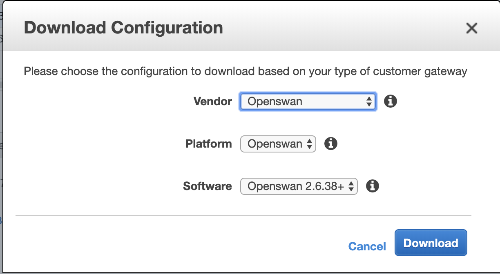

# PiFrost
PiFrost is a solution, a device that can facilitate the demonstration of VPN connections to AWS environment, including transit gateway. This project provides instruction on how to connect an on-premises network to an AWS VPC leveraging a Raspberry Pi as the Customer Gateway and a Transit Gateway the terminating endpoint in AWS. Included are steps to establish the VPN connection and a bill of materials for the Raspberry Pi.


## Initial Raspberry Pi Setup
If you don't have access to an HDMI monitor, USB keyboard, and USB mouse, then you might want to consider doing your initial WiFi setup headless so that you can SSH into your Raspberry Pi and begin setting up Openswan.

Plug your SD card back into your computer, once the SD Card appears, open the Terminal app on your Mac and type:

`cd /Volumes/boot`

Next, create a file called “wpa_supplicant.conf”.

`vim wpa_supplicant.conf`

Populate the file with information on how to connect to your Wifi.

```
ctrl_interface=DIR=/var/run/wpa_supplicant GROUP=netdev
network={
    ssid="YOUR_NETWORK_NAME"
    psk="YOUR_PASSWORD"
    key_mgmt=WPA-PSK
}
```
Enable SSH by default, you can do this by creating a blank SSH file in your boot directory.

`touch ssh`

## Initial AWS setup
A transit gateway is a network transit hub that you can use to interconnect your virtual private clouds (VPC) and on-premises networks.

Follow the [Getting Started](https://docs.aws.amazon.com/vpc/latest/tgw/tgw-getting-started.html) document to implement Transit Gateway in your AWS account.

*It is highly recommended that you have Transit Gateway implemented and working before you attempt to establish a VPN.*

To establish a VPN with transit gateway, follow the [Transit Gateway VPN attachment](https://docs.aws.amazon.com/vpc/latest/tgw/tgw-vpn-attachments.html) documentation. On [Step 6](https://docs.aws.amazon.com/vpc/latest/tgw/tgw-vpn-attachments.html#create-vpn-attachment), Routing options choose Static

## Creating the VPN Tunnel
First, ssh into your Pi  

`ssh pi@<your Pi IP>`

Install Openswan on your Pi

`sudo apt-get install -y openswan lsof`

Update /etc/ipsec.conf to reflect the following:

```
version 2.0     # conforms to second version of ipsec.conf specification

# basic configuration
config setup
        # Enable core dumps (might require system changes, like ulimit -C)
        dumpdir=/var/run/pluto/
        # NAT-TRAVERSAL support, see README.NAT-Traversal
        nat_traversal=yes
        virtual_private=
        # OE is now off by default. Uncomment and change to on, to enable.
        oe=off
        # which IPsec stack to use. auto will try netkey, then klips then mast
        protostack=netkey

include /etc/ipsec.d/*.conf
```

Next, create the configuation file at `/etc/ipsec.d/aws.config`. To download the config, open the Amazon VPC console [here](https://console.aws.amazon.com/vpc/)

In the navigation page, select the new Site-to-Site VPN connection and choose Download Configuration.
Download the Openswan configuration file for the Raspberry Pi.



The configuration will look like this:

```
conn Tunnel1
	authby=secret
	auto=start
	left=%defaultroute
	leftid=<CUSTOMER GATEWAY EXTERNAL IP >
	right=<AWS GATEWAY EXTERNAL IP>
	type=tunnel
	ikelifetime=8h
	keylife=1h
	phase2alg=aes128-sha1;modp1024
	ike=aes128-sha1;modp1024
	auth=esp
	keyingtries=%forever
	keyexchange=ike
	leftsubnet=<LOCAL NETWORK CIDR>
	rightsubnet=<REMOTE NETWORK CIDR>
	dpddelay=10
	dpdtimeout=30
	dpdaction=restart_by_peer
```
Add the tunnel pre-shared key to `/var/lib/openswan/ipsec.secrets.inc`

The secret will be included in the downloaded configuration.

To enable the IPv4 forwarding, edit /etc/sysctl.conf, and ensure the following lines are uncommented:

```
net.ipv4.ip_forward=1
net.ipv4.conf.all.accept_redirects = 0
net.ipv4.conf.all.send_redirects = 0
net.ipv4.conf.default.send_redirects = 0
net.ipv4.conf.default.accept_redirects = 0
```

Run `sysctl -p `to reload it.

Restart IPsec service with `systemctl restart ipsec`

Verify that the IPsec service is running

`systemctl status ipsec`

If the IPsec tunnel is running, you should see it showing as up in the console.


## Validating The Tunnel
To validate the connection end-to-end, create an EC2 instance in a VPC that is connected to the Transit Gateway.

Configure the security group to allow for ICMP traffic from the network behind the Raspberry Pi.
